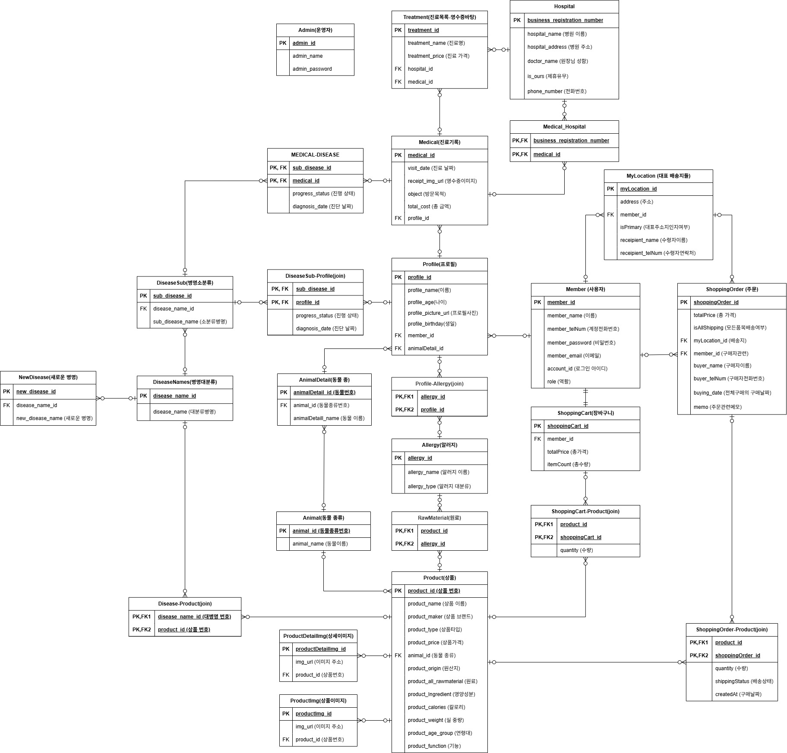

# 🐶 멍지냥지 - 반려동물 통합 서비스 플랫폼

## 프로젝트 개요
**개인 맞춤형 반려동물 통합 서비스 플랫폼**  
이 프로젝트는 반려동물 보호자들이 다양한 상품 및 병원 정보를 한곳에서 확인하고,  
자신의 반려동물 상태에 맞춘 맞춤형 추천을 받을 수 있도록 구성된 서비스입니다.
2024년 기업 연계 프로젝트에서 4인이 팀을 이루어 개발했습니다.

## 사용기술
- **Backend**: Java, Spring Boot, JPA, Spring Security
- **Frontend**: Vue.js
- **Database**: MySQL
- **Infra**: AWS EC2, S3, RDS
- **협업**: Git, Notion, Figma

## 주요 기능
- **회원**: 회원가입, 로그인, JWT 기반 인증/인가
- **상품**: 상품 등록/수정/삭제, 상품 추천 기능
- **주문**: 주문 등록, 배송 상태 관리
- **관리자**: 상품 관리, 주문/배송 모니터링
- **기타**: 알러지 필터링, 반려동물 프로필 기반 추천

## 시연 영상 및 결과

## ERD & API 명세


## 📁 프로젝트 구조

```bash
pet-service-platform/
├── admin/
│   ├── backend/           # 관리자 백엔드 (Spring Boot + Thymeleaf)
│   └── frontend/          # (간단한 관리자 화면, 선택 사항)
├── service/
│   ├── backend/           # 사용자 백엔드 (Spring Boot)
│   └── frontend/          # 사용자 프론트엔드 (Vue.js)
├── docs/                  # 발표 자료 등 문서
│   └── presentation.pptx
├── images/                # 서비스 화면 및 ERD 이미지
└── README.md
